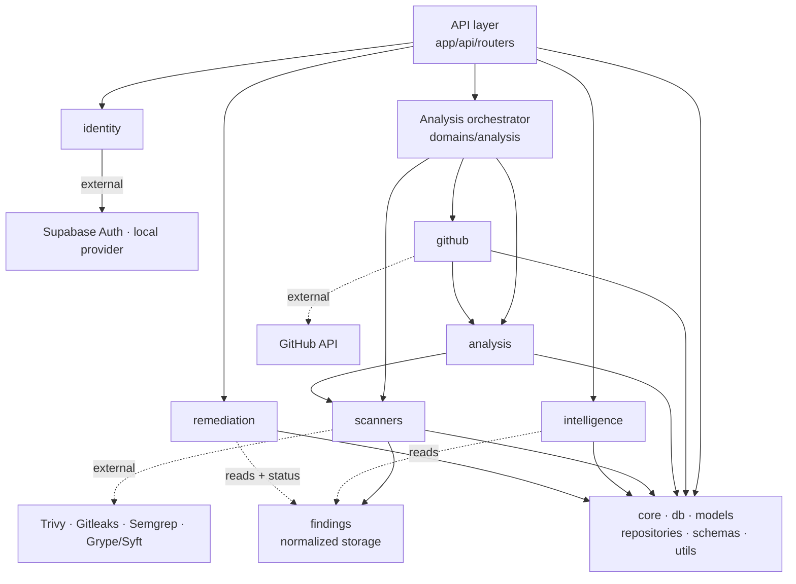

# Module Dependency

How the backend modules communicate — and the rules that keep the architecture
from turning into spaghetti as new domains land.

## Layered dependency flow

```
┌──────────────────────────────────────────────────────────────┐
│  API layer  (app/api/routers)                                │
│  Parses HTTP, validates via schemas, delegates to domains    │
└───────────────────────────────┬──────────────────────────────┘
                                │
┌───────────────────────────────▼──────────────────────────────┐
│  Composition points                                          │
│  Analysis orchestrator (domains/analysis/orchestrator.py)    │
│  and API composition roots — the ONLY places that compose    │
│  multiple domains                                            │
└───────────────────────────────┬──────────────────────────────┘
                                │
┌───────────────────────────────▼──────────────────────────────┐
│  Domains  (app/domains/*)                                    │
│  Business logic per domain — never import each other         │
│  identity · health · github · analysis · scanners ·          │
│  intelligence · remediation                                  │
└───────────────┬──────────────────────────────┬───────────────┘
                │                              │
┌───────────────▼──────────────┐  ┌────────────▼───────────────┐
│  Shared infra                │  │  External integrations      │
│  core · db · models          │  │  GitHub API · scanners      │
│  repositories · schemas      │  │  Supabase Auth              │
│  utils                       │  │                             │
└──────────────────────────────┘  └─────────────────────────────┘
```

## Pipeline dependency diagram

```
GitHub ──▶ Analysis ──▶ Scanners ──▶ Intelligence ──▶ Remediation
                                (Trivy · Gitleaks ·      ▲
                                 Semgrep · Grype/Syft)   └── Finding status
                                                             lifecycle

All arrows are *data flow* orchestrated by the analysis orchestrator —
never direct imports between domain packages.
```

## Mermaid (renders on GitHub)



## Dependency rules

1. **Routers** parse/validate and call exactly one domain (or the
   orchestration layer). They never touch models or repositories.
2. **Domains** depend only on shared infra (`core`, `db`, `models`,
   `repositories`, `utils`). No domain-to-domain imports — ever.
3. **Composition** happens only in the analysis orchestrator
   (`domains/analysis/orchestrator.py`) and API composition roots; domains
   stay ignorant of each other. The empty `app/workers/` package is reserved
   for future out-of-process job execution.
4. **External tools** (GitHub, scanners, LLM) are reached through ports
   defined inside domains; implementations are adapters. This is what makes
   GitLab/Bitbucket/Azure DevOps/Kubernetes additions non-breaking (Sprint 3A
   ships the `github` source-provider port in `domains/github/ports.py`;
   GitLab et al. implement it).

## Extensibility matrix

| New capability | What changes |
| --- | --- |
| GitLab / Bitbucket / Azure DevOps | New provider adapter implementing the source-provider port (`domains/github/ports.py`, Sprint 3A) + their OAuth token storage in `provider_tokens`. No downstream domain changes. |
| New scanner | New scanner provider (runner + parser) in `domains/scanners/providers/` behind the existing registry + `ANALYSIS_SCANNERS` value. Findings are normalized in `scanners/`. |
| Kubernetes target analysis | New analysis capability in `analysis/` (or a new domain); orchestrated like the rest. |
| CI/CD scanning gate or scheduled re-scans | New scheduling/trigger layer; the orchestrator and reaper already expose the needed recovery hooks. |
