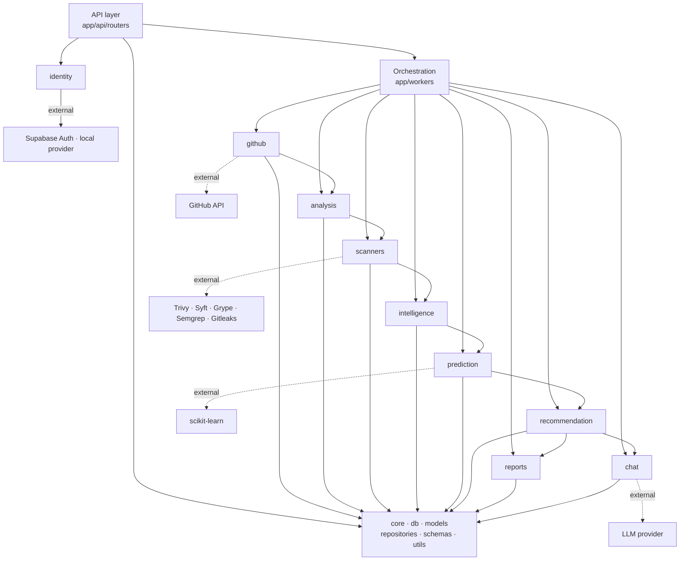

# Module Dependency

How the backend modules communicate — and the rules that keep the architecture
from turning into spaghetti as new domains land.

## Layered dependency flow

```
┌──────────────────────────────────────────────────────────────┐
│  API layer  (app/api/routers)                                │
│  Parses HTTP, validates via schemas, delegates to domains    │
└───────────────────────────────┬──────────────────────────────┘
                                │
┌───────────────────────────────▼──────────────────────────────┐
│  Orchestration  (app/workers, app/api use-cases)             │
│  The ONLY place allowed to compose multiple domains          │
└───────────────────────────────┬──────────────────────────────┘
                                │
┌───────────────────────────────▼──────────────────────────────┐
│  Domains  (app/domains/*)                                    │
│  Business logic per domain — never import each other         │
│  identity · health · github · analysis · scanners …          │
└───────────────┬──────────────────────────────┬───────────────┘
                │                              │
┌───────────────▼──────────────┐  ┌────────────▼───────────────┐
│  Shared infra                │  │  External integrations      │
│  core · db · models          │  │  GitHub API · scanners      │
│  repositories · schemas      │  │  Supabase Auth · Renovate   │
│  utils                       │  │  LLM (behind domain ports)  │
└──────────────────────────────┘  └─────────────────────────────┘
```

## Pipeline dependency diagram

```
GitHub ──▶ Analysis ──▶ Scanners ──▶ Intelligence ──▶ Prediction
                                    │                    │
                                    └────────▶ Recommendation ──▶ Reports
                                                          │
                                                          └──▶ Chat

All arrows are *data flow* orchestrated by app/workers — never direct
imports between domain packages.
```

## Mermaid (renders on GitHub)



## Dependency rules

1. **Routers** parse/validate and call exactly one domain (or the
   orchestration layer). They never touch models or repositories.
2. **Domains** depend only on shared infra (`core`, `db`, `models`,
   `repositories`, `utils`). No domain-to-domain imports — ever.
3. **Orchestration** (`workers/`) is the single composition point for
   multi-domain flows; domains stay ignorant of each other.
4. **External tools** (GitHub, scanners, LLM) are reached through ports
   defined inside domains; implementations are adapters. This is what makes
   GitLab/Bitbucket/Azure DevOps/Kubernetes additions non-breaking (Sprint 3
   defines the `github` source-provider port; GitLab et al. implement it).

## Extensibility matrix

| New capability | What changes |
| --- | --- |
| GitLab / Bitbucket / Azure DevOps | New provider adapter implementing the source-provider port (Sprint 3). No downstream changes. |
| New scanner | New `Scanner` adapter in `scanners/`; findings already normalized. |
| Kubernetes target analysis | New analysis capability in `analysis/` (or a new domain); orchestrated like the rest. |
| Renovate integration | New domain or adapter under `github/`/`analysis/`; wired in `workers/`. |
| New LLM vendor | New chat adapter behind the `chat` port. |
